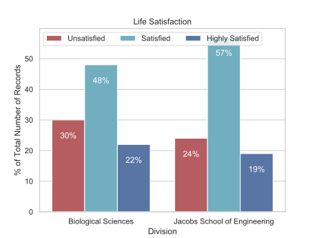
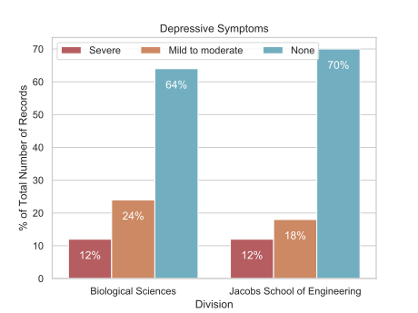
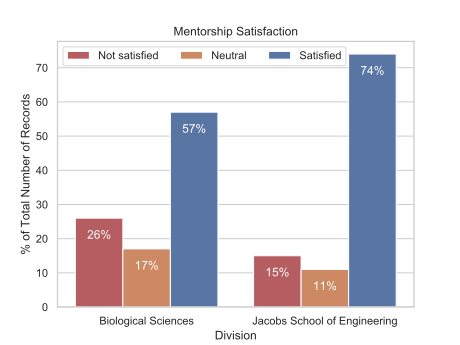
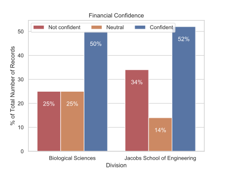
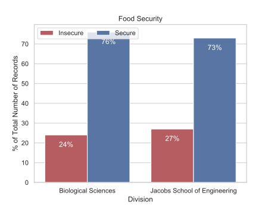
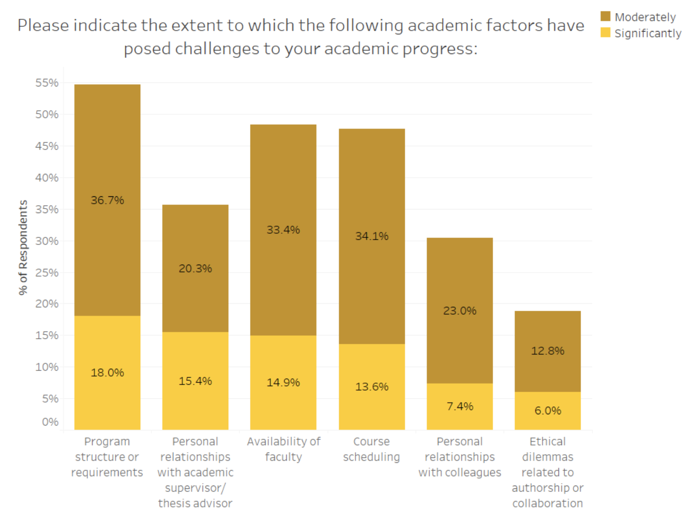
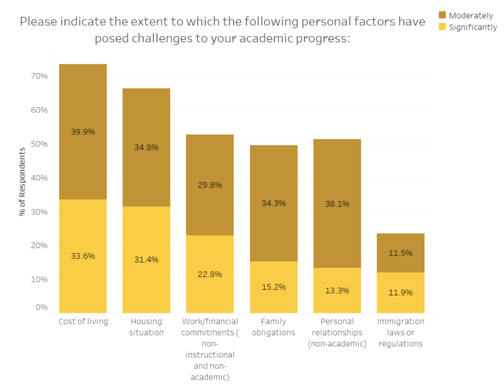
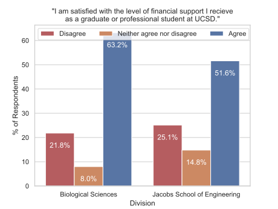

# Graduate School and Mental Health

_Thanks to Owen Chapman and Michelle Ragsac for their input & suggestions._
_This QR code links to the online version of this document._

There is a growing discussion of mental health in the academic community.
Of particular concern is the mounting quantity of anectodal reports and
empirical data that point to a crisis of mental health problems among graduate
students. Here is an illustrative (but not exhaustive) selection of news &
opinion articles to this effect:

- [The Emotional Toll of Graduate School](https://blogs.scientificamerican.com/observations/the-emotional-toll-of-graduate-school/) (2019)
- [Feeling overwhelmed by academia? You are not alone](https://www.nature.com/articles/d41586-018-04998-1) (2018)
- [Mental health in academia is too often a forgotten footnote. That needs to change](https://www.sciencemag.org/careers/2018/04/mental-health-academia-too-often-forgotten-footnote-needs-change) (2018)
- [Academia is built on exploitation. We must break this vicious circle](https://www.theguardian.com/higher-education-network/2018/may/18/academia-exploitation-university-mental-health-professors-plagiarism) (2018)
- [More academics and students have mental health problems than ever before](http://theconversation.com/more-academics-and-students-have-mental-health-problems-than-ever-before-90339) (2018)
- [Graduate School Can Have Terrible Effects on People’s Mental Health](https://www.theatlantic.com/education/archive/2018/11/anxiety-depression-mental-health-graduate-school/576769/) (2018)
- [Graduate school should be challenging, not traumatic](https://chroniclevitae.com/news/2130-graduate-school-should-be-challenging-not-traumatic) (2018)
- [New study says graduate students' mental health is a "crisis"](https://www.insidehighered.com/news/2018/03/06/new-study-says-graduate-students-mental-health-crisis) (2018)
- [Ph.D. students face significant mental health challenges](https://www.sciencemag.org/careers/2017/04/phd-students-face-significant-mental-health-challenges) (2017)
- [Berkeley study finds high levels of depression among graduate students](https://www.insidehighered.com/news/2015/04/22/berkeley-study-finds-high-levels-depression-among-graduate-students) (2015)

## A mental health crisis in graduate education

Several of the above articles reference published academic studies of mental
health among graduate students that have been carried out over the past few
years. They include:

- [Graduate Student Happiness & Well-Being Report | 2014](http://ga.berkeley.edu/wp-content/uploads/2015/04/wellbeingreport_2014.pdf)
    * > About 47% of PhD. students reach the thershold considered depressed, a
    10 out of 30 on the depression scale. U.C. Berkeley, 2014.
- [Work organization and mental health problems in PhD students](https://www.sciencedirect.com/science/article/abs/pii/S0048733317300422)
    * > ... in terms of mental health problems, PhD students were consistently more affected (as indicated by the higher number of symptoms) than the highly educated general population, highly educated employees, and higher education students. _Research Policy_, 2017.
- [Evidence for a mental health crisis in graduate education](https://www.nature.com/articles/nbt.4089)
   * > Our results show that graduate students are more than six times as likely to experience depression and anxiety as compared to the general population. _Nature Biotechnology_, 2018.
- [Graduate Student Mental Health: Lessons from American Economics Departments](https://scholar.harvard.edu/bolotnyy/publications/graduate-student-mental-health-lessons-american-economics-departments)
    * > The prevalence of depression and anxiety symptoms among Economics PhD students is comparable to the prevalence found in incarcerated populations. Harvard University, 2018.

All of these studies reach the same conclusion: Graduate students suffer from
disproportionately high rates of mental illness, this problem is a severe
drain on their productivity and well-being, and it demands immediate policy
intervention.

## Mental health and grad exprience statistics at UCSD

While anecdotal and empirical evidence do indicate severe mental health problems
among graduate students as a whole, there is high variability in student
experiences among different universities, departments, and programs. Having
said that, mental health is a critical issue for students at UCSD and is already
becoming a topic of discussion among students and faculty in biological science,
bioengineering and bioinformatics. See [slides from a talk by Prof. Rob Knight](
bioengineering_faculty_spotlight_jan_29.pdf).

It is important that we consider statistics collected from UCSD that are
relevant to the BISB program as much as possible. Two recent [UCSD Institutional
Research](https://ir.ucsd.edu/grad/index.html) surveys provide useful
information:

- [2016 Graduate Student Well-Being Survey](https://ir.ucsd.edu/grad/surveys/GraduateWellBeing.html)
- [2017 Graduate and Professional Student Experience and Satisfaction (GPSES) Survey](https://ir.ucsd.edu/grad/surveys/gpses.html)

### 2016 Graduate Student Well-Being Survey

This section highlights selected statistics from the [2016 survey](https://ir.ucsd.edu/grad/surveys/GraduateWellBeing.html) which concern
the Biological Sciences division and Jacobs School of Engineering, and thus
are relevant to BISB students. It does not summarize the entire report.

While students in BS and JSOE may fare slightly better than the general graduate
student population, they still suffer high rates of
depressive symptoms, and a large fraction report poor life satisfaction and/or
poor financial confidence.

A notable finding of the study was that many of the values shown here were
correlated with students' rate of academic progress.

> 
>
> 30% of graduate students in BS and 24% in JSOE reported low life satisfaction.

> 
>
> 36% of graduate students in BS and 30% in JSOE reported mild to severe depressive symptoms.

> 
>
> 26% of graduate students in BS and 15% in JSOE were not satisfied with the mentorship they recieved.

> 
>
> 25% of graduate students in BS and 34% in JSOE were not confident about their financial situation.

> 
>
> 24% of graduate students in BS and 27% in JSOE experienced concerns about and/or instances of having insufficient food in the most recent year.

### 2017 Graduate and Professional Student Experience and Satisfaction (GPSES) Survey

This section highlights selected statistics from the [2017 survey](https://ir.ucsd.edu/grad/surveys/gpses.html) which indicate the most significant challenges to academic progress. It does not summarize the entire report.

The most common academic challenge to students' degree progress was program structure/requirements. The most common personal challenge was cost of living, and many students were dissatisfied with the financial support they recieved. 

> 
>
> Program structure or requirements was the most common academic challenege impacting academic progress.

> 
>
> Cost of living was the most common personal challenge impacting academic progress.

> 
>
> In BS, 21.8% of graduate students were dissatisfied with their level of financial support, while 63.2% were satisfied. In JSOE, 25.1% were dissatisfied while 51.6% were satisfied.

## Conclusions & recommendations

At a national & international scale, graduate students suffer mental illnesses
at much higher rates than the general population. Data from the Biological
Sciences division and Jacobs School of Engineering at UCSD suggest that
BISB students are also at high risk of mental illness. Poor mental health
among students may be causing a severe drain on their productivity and
well-being. The program administration should immediately take measures to
asses & support students' mental health in order to avoid the potentially high
cost of inaction.

Across UCSD, graduate student life satisfaction & incidence of depressive
symptoms were correlated with timely academic progress. Students have reported 
**cost of living** and **program structure or requirements** as frequent
challenges to their academic progress, so these points are good targets for
improvement.

Recommendations to reduce and prevent the impact of mental illness on BISB
students:

- **Promote awareness among faculty & students.** Greater awareness of mental
health issues, their causes, and their consequences will benefit both faculty
and students. For example, faculty who are attentive to their students'
workloads and avoid overworking them will be rewarded with more productive and
engaged students. Students who recognize the commonplace nature of
mental health issues will be more likely to seek support or treatment for
themselves and avoid the worst symptoms.

- **Involve CAPS psychologists.** Organizing workshops with CAPS psychologists
focused on graduate student wellness would provide direct support for
the mental health of BISB students and reduce their susceptibility to future
mental illness.

- **Raise the stipend.** UCSD Institutional Research surveys indicate that
many BS and JSOE students are not confident in their financial situation,
and students university-wide find cost of living to be a frequent challenge
to their academic progress. Increasing the stipend will hasten students'
academic progress and bolster their mental health.

- **Standardize, clarify, and streamline BISB program structure and requirements.**
Institutional Research surveys also indicate that program structure and
requirements are major challenges to academic progress for grad students at
UCSD. Spending time hunting down the details of program requirements or
handling unexpected bureaucratic mishaps drain students' energy and their
confidence in themselves and the BISB program. Keeping such factors to a minimum
will relieve students of significant stressors and allow them to focus on their
research.

As a final thought, it bears mentionioning that BISB aims to be an exemplary,
**world class** establishment of bioinformatics training. If we plan to maintain
that assertion then we need to be better than the average grad program at UCSD.
Prompt, effective action on these points is all the more necessary.

## Appendix: Relevant UCSD resources

Some under-advertised UCSD resources that might be helpful to students
struggling with mental health (or other) issues include:

- [Triton Food Pantry](https://basicneeds.ucsd.edu/triton-food-pantry/index.html) (Discreet service to UCSD students in need of food)
- [The Hub](https://basicneeds.ucsd.edu) (Basic Needs resources)
- [The Zone](https://wellness.ucsd.edu/zone/Pages/default.aspx) (lounge for student health, well-being, and wellness programs)
